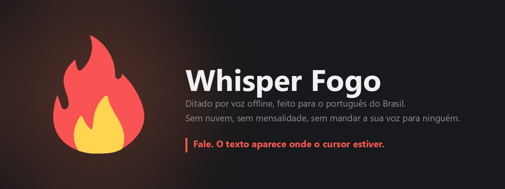
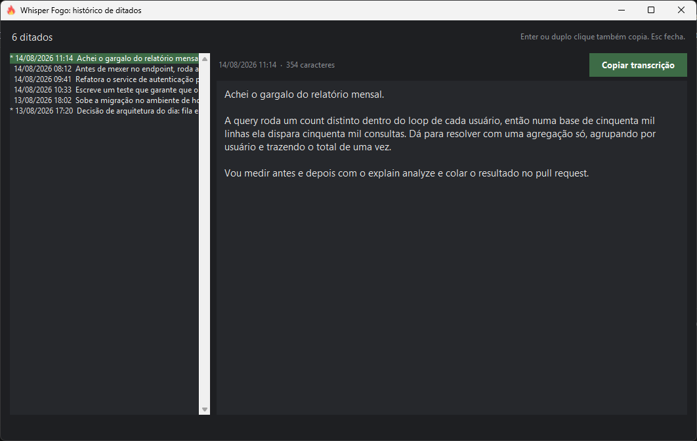
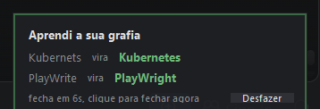

<div align="center">



**Ditado por voz que roda inteiro na sua máquina, feito para o português do Brasil.**

Você fala, o texto aparece onde o cursor estiver. Em qualquer programa.
Sem nuvem, sem mensalidade, sem enviar suas informações para servidor nenhum.

<br>

<a href="https://github.com/bruno-org/whisper-fogo/releases/latest/download/Instalar-Whisper-Fogo.bat"></a>&nbsp;&nbsp;<a href="https://github.com/bruno-org/whisper-fogo/releases/latest/download/Instalar-Whisper-Fogo.zip"></a>

<br><br>


</div>

---

## Por que este existe

Ditado por voz bom sempre foi coisa de quem fala inglês. As ferramentas que valem
a pena cobram mensalidade, mandam a sua voz para a nuvem e tratam o português como
idioma secundário: transcrevem "Claude" como "cloud", trocam o nome da sua empresa,
não entendem a gíria e ainda escrevem "voce" sem acento.

O Whisper Fogo nasceu de uma decisão simples: **o português do Brasil é o idioma
principal, não um item da lista de suportados.** Tudo aqui foi escolhido pensando
em quem fala português: o modelo, o dicionário que aprende as suas palavras e até
as regras de pontuação, que proíbem travessão porque quase ninguém usa em texto
de trabalho.

E ele roda **inteiro na sua máquina**. Nenhum áudio, nenhuma transcrição e nenhuma
palavra do seu dicionário saem do seu computador. Não existe conta para criar, não
existe servidor para cair, não existe limite de minutos por mês.

---

## Como funciona na prática

| Você faz | No Windows | No macOS | O que acontece |
|---|---|---|---|
| Fala segurando a tecla | `Ctrl` + `Shift` | `Fn` | Grava enquanto segurar, cola o texto ao soltar |
| Fala de mãos livres | `Ctrl` + `Shift` + `Espaço` | `Fn` + `Espaço` | Fala à vontade, a mesma tecla encerra |
| Soma uma tecla enquanto fala | `Alt` | `Control` | Revisa o texto antes de colar: tira "né", "tipo", "aí", pontua e quebra em parágrafos |
| Clica no ícone | na bandeja | na barra de menus | Abre o histórico de tudo que você já ditou |
| Corrige uma palavra no campo | | | O programa aprende a sua grafia e nunca mais erra aquela palavra |

O texto vai para onde o cursor estiver: editor de código, campo de chat, e-mail,
terminal, formulário no navegador. Se o programa aceita texto, ele aceita a sua voz.

---

## Nada do que você fala se perde

<div align="center">

<br>
<sub>O asterisco à esquerda da data marca o ditado que passou pela revisão de texto, a que você aciona somando <code>Alt</code> enquanto fala, ou <code>Control</code> no Mac.</sub>
</div>

Toda transcrição é salva **antes** de ir para a área de transferência. Se você
ditou e não tinha campo de texto em foco, a colagem cai no vazio, mas o texto
continua aqui. Abre o histórico, clica em **Copiar transcrição** e segue a vida.

Se a transcrição falhar por qualquer motivo, o áudio é guardado em disco em vez
de evaporar. O que você falou é seu.

---

## Ele aprende as suas palavras sozinho

<div align="center">

</div>

Ditou, o texto colou, e você corrigiu uma palavra ali mesmo no campo? O Whisper
Fogo percebe, aprende a grafia certa e passa a acertar sempre. Aparece um aviso
no canto da tela mostrando o que foi aprendido, com um botão de **Desfazer** para
o caso de você não querer.

Não é keylogger: o programa pergunta ao sistema operacional o conteúdo do campo,
pelo mesmo caminho que um leitor de tela usa, e só durante 60 segundos depois de
colar. Campo de senha nunca é lido, e nada disso vai para log nenhum.

**O que vira regra, e o que não vira.** Nome próprio, marca, sigla e termo técnico
entram na primeira correção. Palavra comum do português só entra se você corrigir
duas vezes, senão uma escolha circunstancial viraria regra permanente. Reformatação,
troca de número e correção que não parece erro de transcrição são descartadas.

Você também pode ensinar à mão, editando `dicionario.json`:

```json
{
  "trocas":     { "Cloud Code": "Claude Code", "Verso": "Vercel" },
  "maiusculas": [ "GitHub", "PostgreSQL" ],
  "hotwords":   [ "Kubernetes", "endpoint", "deploy" ],
  "expansoes":  false
}
```

`hotwords` é o vocabulário que o reconhecedor deve esperar ouvir. `expansoes` liga
a troca de "pra" por "para" e "tá" por "está" no texto final.

---

## Instalação

### Para quem só quer usar

Clique no botão do seu sistema, o arquivo baixa, e você dá dois cliques nele. O
instalador confere se a sua máquina aguenta, instala tudo numa pasta isolada,
baixa os modelos, cria o atalho e abre o programa. Não mexe em nada fora da pasta
dele.

<div align="center">

<a href="https://github.com/bruno-org/whisper-fogo/releases/latest/download/Instalar-Whisper-Fogo.bat"></a>&nbsp;&nbsp;<a href="https://github.com/bruno-org/whisper-fogo/releases/latest/download/Instalar-Whisper-Fogo.zip"></a>

</div>

No Windows, o Defender pode perguntar se você confia no arquivo, porque ele não é
assinado digitalmente. Clique em "Mais informações" e depois em "Executar assim
mesmo".

No macOS, o download é um arquivo compactado. Dê dois cliques nele para sair o
aplicativo **Instalar Whisper Fogo** e dois cliques no aplicativo. Na primeira
vez o sistema mostra um aviso: feche o aviso, abra **Ajustes do Sistema >
Privacidade e Segurança**, role até o fim e clique em **Abrir Mesmo Assim**.
Acontece uma vez só.

Ao terminar, o Whisper Fogo abre sozinho, fica na barra de menus, ganha um ícone
no Dock e passa a abrir junto com o Mac. Na primeira gravação o sistema pede
**Microfone** e **Acessibilidade**, as duas em nome do Whisper Fogo.

### Para quem quer mexer no código

```bash
git clone https://github.com/bruno-org/whisper-fogo.git
cd whisper-fogo

# Windows
powershell -ExecutionPolicy Bypass -File instalador/instalar.ps1

# macOS
bash instalador/instalar.sh
```

O instalador detecta que você está dentro do repositório e usa os seus arquivos
locais em vez de baixar de novo. Editou o código? Rode o instalador outra vez ou
copie os `.py` por cima da pasta de instalação.

### O que a sua máquina precisa ter

Os números abaixo foram **medidos**, não estimados: é o consumo real do programa
transcrevendo, numa RTX 4050 de notebook e num MacBook Air M1.

**No Windows**

|  | Mínimo | Recomendado | Ideal |
|---|---|---|---|
| **Placa de vídeo** | nenhuma, roda na CPU | NVIDIA com **4 GB** de VRAM | NVIDIA com **6 GB** ou mais |
| **VRAM livre** | zero | 2,5 GB | 6 GB |
| **Memória RAM** | 4 GB | 8 GB | 16 GB ou mais |
| **Disco** | 4 GB | 8 GB | 8 GB |
| **Velocidade** | ~1,4x o tempo real | ~15x | **~29x** |
| **O que dá para usar** | só transcrição | transcrição e revisão, uma de cada vez | transcrição e revisão juntas na memória |

**No macOS**

|  | Mínimo | Recomendado | Ideal |
|---|---|---|---|
| **Chip** | Intel Core i5 | **Apple Silicon** M1 ou M2 | Apple Silicon **Pro, Max ou M3** em diante |
| **Sistema** | macOS 11 | macOS 13 | macOS 14 ou mais novo |
| **Memória RAM** | 8 GB | 8 GB | 16 GB ou mais |
| **Disco** | 7 GB | 7 GB | 7 GB |
| **Velocidade** | ~1,2x o tempo real | **~2x** | ~4x |
| **O que dá para usar** | só transcrição | transcrição e revisão, uma de cada vez | transcrição e revisão juntas na memória |

**Traduzindo a velocidade:** o número é quantas vezes mais rápido que o tempo
real, então quanto maior, menos você espera. No Windows, 1 minuto de fala vira
texto em uns 45 segundos no mínimo e em 2 segundos no ideal. No macOS, o mesmo
minuto sai em uns 50 segundos no mínimo, em 30 segundos no recomendado e em 15
segundos no ideal.

**Quanto cada parte ocupa da placa**, medido aqui:

| O que carrega | VRAM |
|---|---|
| Transcrição, precisão padrão (`float16`) | 2,2 GB |
| Transcrição, modo econômico (`int8`) | 1,2 GB |
| Revisão de texto (Gemma 3 4B) | 3,0 GB |
| As duas ao mesmo tempo | 5,2 GB |

<details>
<summary><b>Por que precisa ser NVIDIA, e o que acontece com AMD, Intel ou Mac</b></summary>

<br>

O motor de transcrição é o [CTranslate2](https://github.com/OpenNMT/CTranslate2),
e ele aceita exatamente dois tipos de dispositivo: **CPU e CUDA**. Não existe
suporte a ROCm (AMD), Metal (Apple), Intel Arc, Vulkan ou OpenCL. Dá para conferir
em uma linha:

```python
>>> import ctranslate2
>>> ctranslate2.get_supported_compute_types("cuda")
{'float16', 'int8', 'bfloat16', 'float32', ...}
>>> ctranslate2.get_supported_compute_types("rocm")
ValueError: unsupported device rocm
```

Ou seja: se a sua placa não é NVIDIA, ela não vai ser usada, e o programa cai para
a CPU automaticamente. **Ele funciona**, só que na velocidade da coluna "mínimo".
Uma Radeon boa não ajuda em nada aqui, e é melhor você saber disso antes de baixar
4 GB do que depois.

O instalador detecta tudo isso sozinho, mede a sua máquina e avisa antes de baixar
qualquer coisa. Se não houver GPU utilizável, ele pergunta se você quer instalar
assim mesmo.

</details>

---

## O que é instalado

| Componente | Tamanho | Para quê |
|---|---|---|
| Whisper `large-v3-turbo` | 1,6 GB | Transcrever a fala |
| Gemma 3 4B (`Q4_K_M`) | 2,4 GB | Revisar o texto quando você soma `Alt`, ou `Control` no Mac |
| llama.cpp | 1,1 GB no Windows, 11 MB no Mac | Rodar o modelo de revisão, com CUDA no Windows e Metal no Mac |
| Python isolado e bibliotecas | ~2 GB | O programa em si |

A revisão de texto é opcional e o instalador pergunta, nos dois sistemas. Sem
ela, o ditado funciona igual, só não tem a tecla de revisão.

**Velocidade medida** numa RTX 4050 para notebook: 42 minutos de áudio transcritos
em 86 segundos, ou 29 vezes mais rápido que o tempo real. Ditados curtos do dia a
dia saem em 2 a 6 segundos.

---

## Desempenho e privacidade, em números

- **0 bytes** enviados para a internet durante o uso. O download acontece uma vez, na instalação.
- **0 conta** para criar. Não existe login, não existe telemetria, não existe servidor.
- **60 segundos** é a janela em que o programa observa o campo para aprender a sua grafia. Fora dela, ele não olha nada.
- **1 hora** de fala contínua por ditado, o teto de segurança contra microfone esquecido aberto.
- **10 minutos** sem uso e o modelo sai da memória da placa de vídeo sozinho, devolvendo a VRAM para os seus outros programas.

---

## Como o programa é feito

Python puro, sem framework, sem servidor local, sem Electron. Cada arquivo faz uma
coisa:

| Arquivo | Responsabilidade |
|---|---|
| `voz.py` | O programa: ícone na bandeja ou na barra de menus, gravação, transcrição, colagem |
| `teclado.py` | O atalho global, com a máquina de estados de segurar e travar |
| `clip.py` | Área de transferência e colagem, por sistema operacional |
| `corrigir.py` | Aplica o dicionário na transcrição |
| `aprendizado.py` | Decide o que vira regra de grafia a partir das suas correções |
| `observador.py` | Lê o campo por API de acessibilidade e observa por 60 segundos |
| `historico.py` | Registro em disco e a janela de histórico |
| `aviso.py` | O aviso de palavra aprendida, com desfazer |
| `limpar.py` | A revisão de texto pelo modelo local |

**Testes.** 45 asserts, todos rodando sem microfone e sem placa de vídeo:

```bash
cd whisper_fogo
python corrigir.py      # 10 asserts: dicionário e expansões
python aprendizado.py   # 21 asserts: o que vira regra e o que é descartado
python observador.py    #  8 asserts: âncora e janela de observação
python teste_corte.py   #  3 asserts: gravação longa e corte de segurança
python clip.py          #  3 asserts: área de transferência com acento
```

---

## O mesmo programa nos dois sistemas

| Recurso | Windows | macOS |
|---|---|---|
| Instalação de ponta a ponta | sim | sim |
| Ditado com atalho global | `Ctrl` + `Shift` | `Fn` |
| Colagem no cursor | sim | sim |
| Transcrição | GPU NVIDIA | CPU |
| Revisão de texto | GPU NVIDIA | Metal |
| Histórico e cópia | sim | sim |
| Aprender pela sua correção | UI Automation | API de Acessibilidade |
| Ícone sempre à vista | bandeja | barra de menus |

**No Windows** o Whisper Fogo fica em `AppData\Local\WhisperFogo`, com o Python e
as bibliotecas numa pasta isolada. Abre por atalho no Desktop e no menu Iniciar,
fica na bandeja ao lado do relógio, e o ícone de lá leva ao histórico de ditados.
A transcrição e a revisão usam a placa NVIDIA, e o modelo sai da memória de vídeo
sozinho depois de 10 minutos parado.

**No macOS** o Whisper Fogo é um aplicativo em `~/Applications`, com o Python e
as bibliotecas dentro dele. Abre junto com o sistema, fica na barra de menus, tem
ícone no Dock, e o ícone da barra leva ao histórico de ditados. A transcrição usa
a CPU, a revisão usa a GPU pelo Metal, e o sistema pede microfone e acessibilidade
uma vez, em nome do Whisper Fogo.

---

## Perguntas que todo mundo faz

**Minha voz vai para algum servidor?**
Não. O modelo roda na sua máquina. Você pode desligar a internet depois de instalar
e o programa continua funcionando igual.

**Funciona em qualquer programa?**
Em qualquer campo de texto que aceite colar. Editor de código, navegador, chat,
terminal, e-mail, planilha.

**Precisa de placa de vídeo cara?**
Não. Foi construído numa RTX 4050 de notebook, que é placa de entrada. Sem placa
nenhuma ele roda na CPU, só que devagar.

**Por que o primeiro ditado do dia demora mais?**
O modelo carrega na primeira vez que você fala, e isso leva alguns segundos. Depois
fica na memória até você ficar 10 minutos sem ditar.

**Ele funciona em inglês?**
O reconhecedor entende dezenas de idiomas, mas tudo aqui está afinado para
português: o dicionário, a revisão, a lista de palavras comuns. Para inglês existem
boas opções. Para português, esta é a proposta.

**Posso usar no trabalho, em empresa?**
Pode. A licença é MIT, e como nada sai da máquina, não há dado de cliente
trafegando para fora.

---

## Contribuir

Issue e pull request são bem-vindos. O que mais ajuda agora, em ordem:

1. **Casos em que a transcrição erra feio** em português, com o áudio se possível.
2. **Palavras que o aprendizado deveria ou não deveria ter pegado.**

O código é comentado em português e explica o porquê das decisões, não só o quê.
Se for mexer, mantenha esse padrão.

---

## Créditos

Construído sobre [faster-whisper](https://github.com/SYSTRAN/faster-whisper),
[CTranslate2](https://github.com/OpenNMT/CTranslate2),
[llama.cpp](https://github.com/ggml-org/llama.cpp) e os modelos
[Whisper](https://github.com/openai/whisper) e
[Gemma](https://ai.google.dev/gemma). A lista de palavras comuns do português vem
do [FrequencyWords](https://github.com/hermitdave/FrequencyWords).

O comportamento de aprender pela correção foi inspirado no Wispr Flow.

---

<div align="center">

Feito por **Bruno Henrique Leal da Cunha**
Licença [MIT](LICENSE)

</div>
